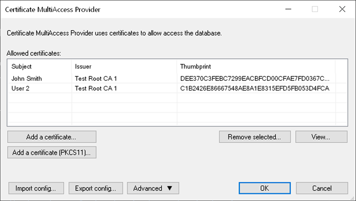
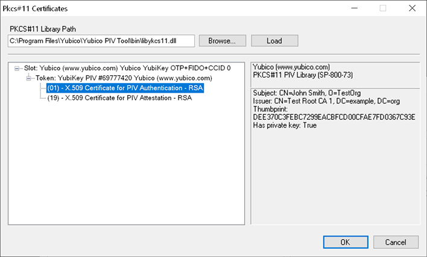
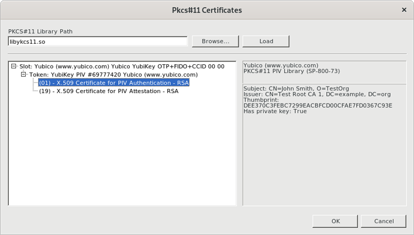

# KeePass Certificate MultiAccess Provider

A KeePass Provider allowing you to open a KeePass database using a X509 certificate, e.g. a certificate on a smart card.

## How?

This provider generate a key encrypted with the public part of an X.509 certificate.

When the provider is used, it decrypts part of the master password using the private part of the certificate, and returns it to KeePass.

## Compatibility

This plugin has been tested on Windows (CryptoAPI/PKCS #11) and Linux (PKCS #11).

## What kind of certificates can I use?

For now, only RSA certificates are supported.

